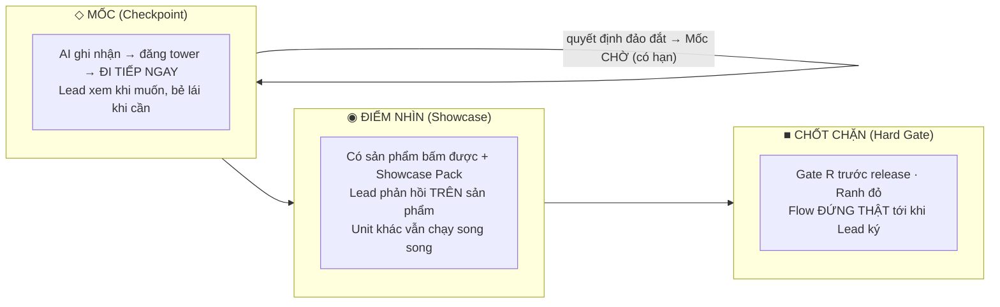
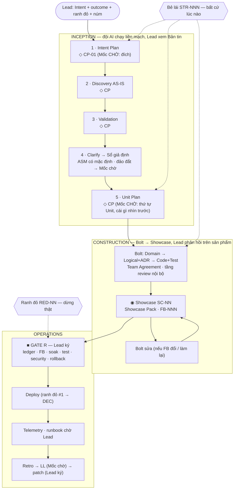

# AI-DLC White Paper v2 — Bản Human-Lead

> **Đây là tài liệu chuẩn (SSOT) của phương pháp từ 2026-08-21.** Mọi mâu thuẫn giữa tài liệu, plugin và Control Tower giải quyết theo bản này.
>
> Dòng dõi: Raja SP (AWS) — *AI-DLC Method Definition* → bản dịch nội bộ v1 (2026-08-09, lưu tại `archive/whitepaper-ai-dlc-vi-v1.md`) → **v2** viết lại từ bốn tuần chạy thật trên PILOT (INT-001 → INT-003, plugin 1.0.0 → 6.0.0).
>
> Bản v2 giữ nguyên **phân cấp Intent → Unit → Bolt → Task**, **ba pha**, **DDD ở lõi**, **context memory** và nguyên tắc **"luật không kiểm được là luật sẽ trượt"**. Bản v2 **thay** cách con người tham gia: từ *người gác bảy cổng* thành *người dẫn đội* — quyết ở chỗ đảo ngược đắt, phản hồi trên sản phẩm chạy được, và ký một chốt chặn thật trước khi release.

---

## 0 · Tại sao phải viết lại

AWS viết: *"Xác nhận của con người là hàm mất mát — mỗi lần rà soát cắt bỏ nỗ lực sai hướng trước khi nó lan xuống hạ nguồn."* Đúng về mục đích. Nhưng cách v1 hiện thực câu đó — **bảy gate chặn cứng (A–G), mỗi gate một tài liệu đọc toàn văn, flow đứng im tới khi người bấm** — tạo ra chính thứ nó định tránh. Dữ liệu từ PILOT:

| Quan sát trên thực địa | Hệ quả |
|---|---|
| Gate D của INT-003 duyệt **unit-plan 30 Unit · 113 giờ** bằng một file markdown | Người đọc không thể quyết đúng từng dòng; hoặc *approve mù* (bị chặn ở UI) hoặc *không approve* (đội AI đứng im). Lượng thông tin vượt sức kiểm của một người — **trượt là tất yếu, không phải lỗi cá nhân.** |
| Gate E(a)/E(b) yêu cầu người soát **design + ADR + diff** trước khi được thấy sản phẩm | Người review đọc code mà không trả lời chính xác được "đúng hay sai" — vì câu hỏi đúng là "*chạy lên có ra cái tôi muốn không*", và câu đó chỉ trả lời được khi có thứ để bấm. |
| 13 review-request → **0 verdict**; 17 Unit đi qua cả hai điểm review và cả hai checkpoint Gate E **mà không dừng lần nào** (LL-002) | Luật chặn nhiều nơi ⇒ không chỗ nào chặn thật. Bảy cổng trên giấy, không cổng nào trên đất. |
| Mỗi gate mở là một lần **đội AI kết thúc lượt và chờ** | Thời gian chờ người trở thành đường găng. Vòng lặp "giờ hoặc ngày" của Bolt bị kéo thành "ngày hoặc tuần" — **bởi người, không bởi AI.** |
| Open questions "CHẶN UOW-NN" phải có người trả lời mới được đi | Nhiều câu có thể chọn mặc định hợp lý và sửa rẻ về sau; nhưng luật bắt dừng — nên đội AI hoặc dừng thật, hoặc *giả vờ hỏi rồi tự trả lời* (không truy vết được). |

Kết luận của v2: **hàm mất mát phải tập trung**, không rải đều. Con người nên tiêu sự chú ý ở ba chỗ: (1) quyết định **đảo ngược đắt**, (2) **sản phẩm chạy được** — nơi họ có thể nói chính xác "đúng / chưa đúng", và (3) **một chốt chặn kỹ lưỡng trước release**. Mọi chỗ khác, AI tự chốt trong đội, **ghi giả định có địa chỉ**, và đi tiếp.

---

## I · Mười nguyên tắc (v2)

Giữ nguyên tinh thần của mười nguyên tắc AWS; viết lại sáu nguyên tắc chạm tới vai trò con người (đánh dấu ★).

1. **Tái hình dung thay vì chắp vá.** Vòng lặp giờ/ngày; Sprint → Bolt; Epic → Unit. *(giữ)*
2. ★ **AI dẫn hội thoại — con người dẫn đội.** AI khởi xướng, phân rã, đề xuất và *tự chốt* với nhau. Con người là **Lead**: đặt đích, đặt ranh đỏ, bẻ lái khi muốn, phản hồi khi nhìn thấy, ký trước khi release. Lead *có quyền* dừng mọi thứ bất cứ lúc nào — nhưng flow **không mặc định chờ** Lead.
3. **Kỹ thuật thiết kế ở lõi.** DDD: Domain Design → Logical Design + ADR → Code + Test, trong từng Bolt. *(giữ)*
4. ★ **Chỉ dừng khi đảo ngược đắt.** Một quyết định có ba thuộc tính: *ai chịu*, *đảo lại tốn bao nhiêu*, *nhìn thấy ở đâu*. Chi phí đảo thấp ⇒ AI chọn mặc định, ghi lại, đi tiếp. Chi phí đảo cao ⇒ dừng *có hạn*. Chạm ranh đỏ ⇒ dừng *thật*. Đây là hàm mất mát của AWS, **nhắm đúng chỗ**.
5. ★ **Giả định thay cho câu hỏi.** Không biết thì không hỏi rồi đứng chờ; chọn phương án hợp lý nhất, ghi thành `ASM-NNN` trong **Sổ giả định** kèm phương án khác và đường lùi, rồi đi tiếp. Lead sửa giả định **khi nhìn thấy nó hiện hình** trong sản phẩm.
6. ★ **Phản hồi trên sản phẩm chạy được, không trên văn bản.** Điểm con người tham gia chính là **Showcase**: có thứ để bấm / gọi / chạy, kèm bản hướng dẫn "bấm gì, nhìn gì, giả định nào đang hiện ở đây". Lead **không đọc diff**; nếu chỉ có diff, đội chưa xong phần chuẩn bị.
7. ★ **Đội tự chốt với nhau.** Bất đồng giữa agent giải quyết bằng **Team Agreement** trong đội (trưởng ca chốt). Con người chỉ thấy bản tóm. Chỉ bất đồng lặp lại hoặc chạm ranh đỏ mới lên Lead.
8. ★ **Một chốt chặn thật trước release — và nó không được rút gọn.** Gate R (Release Readiness) đọc **toàn bộ** Sổ giả định còn mở, mọi phản hồi Showcase, bằng chứng test/bảo mật, kế hoạch lùi. Nới đầu để siết cuối, không phải nới tất.
9. **Luật không kiểm được là luật sẽ trượt.** Mỗi luật có một trường để điền và một KPI để soi. *(giữ — và áp cho chính v2: §IX)*
10. **Đọc đủ nguồn, không dựng bù hồ sơ.** No-unread-source (source-ledger) và "thiếu bolt/evidence thì ghi khoảng trống vào LL" giữ nguyên — nhưng là **kỷ luật của đội AI**, không còn là gate của người. *(giữ, đổi chủ)*

---

## II · Ba loại điểm dừng thay cho bảy gate

Bảy gate A–G của v1 chỉ có một trạng thái: *đứng tới khi người bấm*. v2 tách thành ba loại, khác nhau ở **ai chờ ai**:



| Loại | Ký hiệu | AI làm gì | Lead làm gì | Flow có đứng không | Ghi xuống đĩa |
|---|---|---|---|---|---|
| **Mốc** | `CP-NN` | ghi tóm tắt ≤ 10 dòng + liên kết artefact + ASM mới, đăng tower, **đi tiếp** | đọc *nếu muốn*; bẻ lái bằng `STR-NNN` *nếu cần* | **không** | `checkpoints/CP-NN.md` |
| **Mốc chờ** | `CP-NN` có `wait_until:` | như Mốc, nhưng việc **phụ thuộc** quyết định đó đứng tới `wait_until` (mặc định 4 giờ làm việc, núm dự án); việc không phụ thuộc vẫn chạy. Hết hạn mà Lead im lặng ⇒ **mặc định đã khai được áp**, ASM chuyển `assumed-by-timeout` | quyết trong hạn, hoặc chấp nhận mặc định | **một phần, có hạn** | `CP-NN.md` + `ASM-NNN` với `default_if_silent:` |
| **Điểm nhìn** | `SC-NN` | dựng sản phẩm chạy được + **Showcase Pack** (§IV), đăng tower, **mở Unit kế tiếp** | dùng thử, phản hồi `FB-NNN` trên từng giả định / user story | **không** (phản hồi thành Bolt sửa) | `showcases/SC-NN/` |
| **Chốt chặn** | `GATE-R` · `RED-NN` | dựng hồ sơ Gate R (§V) hoặc hồ sơ ranh đỏ, **kết thúc lượt**, chờ | đọc toàn văn, ký `release` / `hold` | **có, không hạn** | `gates/GATE-R-NN.md` · `red-lines/RED-NN.md` + `DEC` |

### II.1 Ánh xạ từ v1

| v1 | v2 | Lý do |
|---|---|---|
| Gate A — duyệt intent-plan | **Mốc** `CP-01` · riêng phần *Intent + outcome đo được* là **Mốc chờ** (đảo đắt: sai đích là sai tất) | Lead cần xác nhận *đích*, không cần duyệt *từng nguồn sẽ đọc* và *unit map tạm* — hai phần này AI tự chịu trách nhiệm qua source-ledger (§4.8 cũ) |
| Gate B — AS-IS đúng chưa | **Mốc** | Sai AS-IS sẽ lộ ở Showcase đầu tiên; chi phí đảo thấp khi Unit nhỏ và releasable |
| Gate C — chốt open questions nghiệp vụ | **Sổ giả định**: mỗi câu thành một `ASM` có mặc định; câu nào đảo đắt thành **Mốc chờ**; câu nào chạm ranh đỏ thành **Chốt chặn** | Không còn "đứng chờ khách trả lời". Câu hỏi được đưa cho Lead *kèm ví dụ trong sản phẩm* ở Showcase |
| Gate D — duyệt unit-plan | **Mốc chờ** chỉ cho **thứ tự Unit + Unit nào ra Showcase trước** (đảo đắt về mặt lịch); bảng tầng review là việc nội bộ đội | Không ai duyệt được 30 dòng Unit bằng cảm giác. Lead chọn *cái gì nhìn trước*, không duyệt *từng cái* |
| Gate E(a) — design checkpoint | **bỏ** với người; Team Agreement trong đội (peer/specialist theo tầng §4.17 cũ giữ nguyên) | Lead không trả lời chính xác được câu "ADR này đúng không" bằng văn bản |
| Gate E(b) — demo sau review | **Điểm nhìn** `SC` — nâng cấp, không bỏ | Đây mới là chỗ Lead trả lời chính xác được |
| Gate F — UAT / approve deploy | **Gate R** — *siết lại* (§V) | Chốt chặn duy nhất, làm kỹ |
| Gate G — duyệt lesson + patch | **Mốc chờ** cho LL; patch plugin vẫn cần Lead ký (vì đổi luật cho mọi dự án) | Giữ vòng học, bớt nghi thức |
| Gate động — escalation | **Ranh đỏ** `RED` (§VI) | Gọi đúng tên: chỉ dừng khi có lý do dừng |
| Luật preview (approve mù bị cấm) | giữ **chỉ cho Chốt chặn** | Ở Mốc không có nút approve nên không có approve mù |

### II.2 Bẻ lái (Steer) — quyền của Lead ở mọi lúc

Lead không cần chờ tới một điểm dừng để can thiệp. Bất cứ lúc nào, Lead ghi `steer/STR-NNN.md` (hoặc bấm *Bẻ lái* trên tower): *đổi gì · vì sao · áp từ đâu*. Trưởng ca (orchestrator) coi đó là **đầu vào ưu tiên cao nhất**: dừng việc bị ảnh hưởng, lập lại kế hoạch phần chạm, chuyển ASM liên quan sang `overridden`, ghi `CP` mới. Bẻ lái **không làm flow chờ** — chỉ làm nó đổi hướng.

> Khác biệt cốt lõi với v1: v1 *mặc định chờ, can thiệp là bấm nút*; v2 *mặc định chạy, can thiệp là bẻ lái*. Quyền của Lead **tăng** (can thiệp mọi lúc), nghĩa vụ của Lead **giảm** (không phải gác bảy cổng).

---

## III · Sổ giả định (Assumption Ledger)

Đây là artefact trung tâm của v2 — thứ biến "AI tự quyết" từ rủi ro thành tài sản truy vết được. Mỗi quyết định đội AI đưa ra **thay Lead** là một dòng `ASM-NNN` trong `assumptions/ledger.md` (mỗi ASM một file khi cần chi tiết).

```markdown
## ASM-014 · Trạng thái kết thúc của RFE case gọi là "Closed – Responded"
unit: UOW-03        owner: be-dev        at: 2026-08-21T09:40Z
decision: dùng 1 terminal status "Closed – Responded"; không tách "Closed – Withdrawn"
alternatives:
  - tách 2 status (Responded / Withdrawn) — thêm 1 cột, 1 filter report
  - giữ status cũ "Closed" + thêm reason code
why: 3/3 ticket mẫu trong raw/tickets đều là responded; không thấy withdrawn trong 18 tháng log
reversal_cost: thấp   # thấp = < 1 Bolt · vừa = 1 Bolt · cao = đụng data đã ghi / API đã có consumer
visible_at: SC-03 → màn Case detail → badge trạng thái; report "Closed cases" cột Status
default_if_silent: giữ 1 status (đang áp)
sources_checked: raw/tickets/*.md · app-be/models/case.py · wiki/docs/business/case-lifecycle.md — không thấy yêu cầu tách
status: assumed     # assumed · assumed-by-timeout · confirmed · overridden(FB-NNN|STR-NNN) · expired
```

Luật:

1. **Không có ASM thì không được tự quyết.** Agent chọn mặc định mà không ghi ASM ⇒ doctor `FIX` (cùng mức với "dòng `planned` còn treo" của source-ledger).
2. **Ba trường bắt buộc phải có *nội dung thật*:** `reversal_cost` (một trong ba mức, có định nghĩa), `visible_at` (Showcase nào · màn/endpoint nào — *nếu không chỉ được chỗ nhìn thấy thì chưa đủ điều kiện giả định, phải thành Mốc chờ*), `sources_checked` (kế thừa §4.10.9 cũ: đã soát đâu mà không thấy đáp án).
3. **`reversal_cost: cao` ⇒ tự động thành Mốc chờ**; `cao` **và** chạm ranh đỏ ⇒ Chốt chặn. Trưởng ca không được hạ `reversal_cost` để tránh chờ — doctor grep dấu vết (migration, public API, auth) và đối chiếu.
4. **ASM được đóng bởi con người, bằng mắt.** `confirmed` / `overridden` chỉ hợp lệ khi trỏ tới `FB-NNN` (phản hồi tại Showcase) hoặc `STR-NNN` (bẻ lái) hoặc `DEC` (tại Gate R). Agent không được tự `confirmed`.
5. **Gate R không ký khi còn ASM `assumed` có `reversal_cost ≥ vừa`** chưa được nhìn. ASM `thấp` được gom thành một bó "rủi ro thấp — Lead chấp nhận cả bó" với một chữ ký.
6. **ASM hết hạn:** Unit vào `_trash/` hoặc Intent đóng ⇒ ASM `expired`, giữ lại, không xoá (tinh thần §4.14 cũ).

Ledger là thứ Lead đọc **thay cho** intent-plan/unit-plan/ADR: ngắn hơn nhiều, và mỗi dòng có câu trả lời chính xác được (*giữ / đổi*), vì nó chỉ tới chỗ nhìn thấy.

---

## IV · Điểm nhìn (Showcase) và Showcase Pack

Nguyên tắc: **Lead trả lời chính xác được chỉ khi có thứ để dùng.** Mỗi Unit (hoặc Bolt có giao diện/hành vi quan sát được) kết thúc bằng một Showcase. Không có gì để bấm/gọi/chạy ⇒ chưa phải Showcase ⇒ Unit chưa `done`.

### IV.1 Thế nào là "có thứ để dùng"

| Loại Unit | Tối thiểu để mở Showcase |
|---|---|
| Có UI | Môi trường chạy được (local/preview URL) + dữ liệu mẫu đã seed + đường đi ≤ 10 bước |
| API / backend | Môi trường chạy + bộ request mẫu chạy được một lệnh (`make demo`, script, Postman/REST file) + dữ liệu trước/sau nhìn thấy được |
| Batch / migration | Chạy trên bản sao dữ liệu + bảng *trước → sau* + số dòng, số lỗi, thời gian |
| NFR / hạ tầng | Kết quả đo có ca đối chứng (§4.15 cũ) + biểu đồ/bảng đọc được trong 1 phút |
| Tài liệu / BA | Trang wiki render được + ví dụ cụ thể bằng dữ liệu thật |

### IV.2 Showcase Pack — `showcases/SC-NN/README.md`

Một file, đọc trong ≤ 10 phút, **bằng lời**, không thuật ngữ code:

```markdown
# SC-03 · UOW-03 Đóng RFE/NOID case — bản nhìn đầu tiên
chạy ở: http://localhost:3000/cases?demo=sc-03   (hoặc: make demo-sc-03)
đăng nhập: demo-apm / xem ghi chú

## 1 · Bấm gì, nhìn gì (≤ 10 bước)
1. Mở case RFE-2041 → thấy nút **Đóng case** (trước đây không có)
2. Bấm → chọn lý do → xác nhận → badge đổi thành **Closed – Responded**   ← ASM-014
3. Mở report "Closed cases" → case vừa đóng xuất hiện, cột Status             ← ASM-014, ASM-015
...

## 2 · Giả định đang hiện hình ở đây (Lead quyết bằng mắt)
| ASM | Bạn đang nhìn thấy | Nếu đổi thì mất gì |
|---|---|---|
| ASM-014 | chỉ một trạng thái đóng | + nửa Bolt: thêm status + filter |
| ASM-015 | case đóng vẫn tính trong KPI tháng | + 1 giờ: đổi điều kiện report |
| ASM-017 | chỉ APM được đóng, Paralegal không | + 2 giờ: thêm quyền + test |

## 3 · Cần bạn quyết (≤ 3 câu, mỗi câu có ví dụ ngay trên màn)
- Case đóng nhầm có được **mở lại** không? (thử: case RFE-2041 sau khi đóng — hiện không có nút mở lại) — mặc định: không, ghi ASM-018

## 4 · Chưa làm / giới hạn đã biết
- Chưa sync trạng thái sang hệ thống khách (UOW-04)

## 5 · Bằng chứng máy (gấp lại, không bắt đọc)
- tests: 42 pass · mutation score 0.81 · self-verify: evidence/self-verify.md · tầng review: peer (RV-021)
```

### IV.3 Phản hồi — `FB-NNN`

Lead phản hồi **theo dòng**: mỗi FB trỏ một ASM hoặc một user story, verdict `giữ` / `đổi: <gì>` / `làm lại: <vì sao>`. FB `đổi`/`làm lại` sinh Bolt sửa (`BOLT-NN-fix`) — **không mở lại gate nào**, không cần DEC. Lead có thể phản hồi trên tower (nút ba trạng thái cạnh từng dòng) hoặc ghi file.

Luật: **Unit đóng khi Showcase đã mở ≥ 1 lần và mọi FB `đổi`/`làm lại` đã có Bolt sửa + Showcase lại.** Lead không phản hồi ⇒ Unit vẫn đóng được (ASM giữ `assumed`), nhưng **Gate R sẽ chặn** nếu còn ASM ≥ `vừa` chưa nhìn — Lead được nhắc đúng chỗ, không bị chặn sớm.

---

## V · Gate R — chốt chặn trước release (kỹ lưỡng, không rút gọn)

Đây là chỗ **duy nhất** v2 đòi con người đọc nhiều — và vì chỉ có một, nó phải đủ dày. Flow đứng thật. Không có `default_if_silent`. Luật preview (đọc toàn văn mới bật nút) áp ở đây.

Dự án chọn nhịp: **Gate R theo Unit** (continuous delivery — mỗi Unit releasable đi qua Gate R riêng) hoặc **theo Intent** (gom). Mặc định: theo Unit, vì Unit đã được cắt `releasable` từ §4.9 cũ.

### V.1 Hồ sơ Gate R — `gates/GATE-R-NN.md` (AI dựng, Lead đọc)

| # | Mục | Điều kiện ký | Bằng chứng phải trỏ |
|---|---|---|---|
| 1 | **Sổ giả định** | 0 ASM `assumed` có `reversal_cost ≥ vừa`; bó `thấp` được liệt kê đủ để Lead ký một lần | `assumptions/ledger.md` lọc theo Unit |
| 2 | **Phản hồi Showcase** | mọi FB `đổi`/`làm lại` đã đóng bằng Showcase lại | `showcases/SC-NN/feedback.md` |
| 3 | **Lead đã tự dùng** | Lead ghi `soak: <ngày> · <đã đi qua bước nào>` — không phải xem người khác demo | dòng trong hồ sơ |
| 4 | **Kiểm thử** | test pass · mutation score ≥ ngưỡng dự án · ca đối chứng cho mọi phép đo (§4.15 cũ) | `evidence/` |
| 5 | **Bảo mật** | security MUST = 0 (specialist trigger §4.17 cũ đã chạy nếu chạm) | `RV-NNN` security hoặc self-verify mục security |
| 6 | **Truy vết** | Intent → Unit → ASM → code/test nối được (tower vẽ được chuỗi) | `session/INDEX.md` |
| 7 | **Đường lùi** | rollback/runbook viết được trong 10 dòng, đã thử trên staging nếu có migration | `release/rollback.md` |
| 8 | **Ghi chú phát hành cho khách** | bằng lời, ≤ 1 trang, nêu giả định còn mở có thể ảnh hưởng họ | `release/notes-vi.md` |
| 9 | **Khoảng trống trung thực** | phần thiếu evidence được ghi là thiếu, không dựng bù | mục "Khoảng trống" trong hồ sơ |

Verdict: `release` / `hold (kèm danh sách mục chưa đạt)`. `hold` sinh Bolt sửa và mở lại Gate R với changelog — như vòng request-changes cũ, nhưng chỉ ở đây.

### V.2 Vì sao nới đầu thì được, nới cuối thì không

Mọi thứ trước Gate R đều **đảo được bằng một Bolt** nếu Unit cắt đúng (`releasable`, gọn). Sau Gate R, sản phẩm chạm người dùng/dữ liệu thật — chi phí đảo nhảy bậc. Hàm mất mát đặt ở đây là đặt đúng chỗ có độ dốc lớn nhất.

---

## VI · Ranh đỏ (Red lines) — chốt chặn động

Danh sách mặc định của gói; dự án mở rộng trong `governance/red-lines.md`. Chạm một dòng ⇒ đội AI **dừng thật**, dựng `red-lines/RED-NN.md` (bối cảnh · phương án · khuyến nghị · đường lùi), kết thúc lượt, chờ `DEC`.

1. Deploy lên production, hoặc bất kỳ môi trường có người dùng thật.
2. Migration phá huỷ / xoá / ghi đè dữ liệu đã có.
3. Thay đổi public API / contract đã có consumer ngoài đội.
4. Chi tiền, tạo tài khoản dịch vụ, ký điều khoản.
5. Gửi thông tin ra ngoài đội (email khách, message, ticket bên thứ ba).
6. Thay đổi **outcome đo được của Intent** (không phải cách làm — *đích*).
7. Quyết định auth / authz / PII / crypto có `reversal_cost: cao`.
8. Bất đồng trong đội **hai lần cùng một điểm** sau Team Agreement.
9. Phát hiện logic sai từ gốc hoặc tài liệu nguồn mâu thuẫn chạm scope.

Ranh đỏ là **nơi duy nhất** ngoài Gate R mà agent được phép "dừng chờ người". Dừng ở chỗ khác mà không có `RED` hoặc `CP` `wait_until` hợp lệ ⇒ doctor `FIX` ("dừng không lý do" là lãng phí y như "vượt gate").

---

## VII · Vai trò

### VII.1 Lead (con người) — năm việc, không hơn

| Việc | Khi nào | Tốn bao nhiêu |
|---|---|---|
| **Đặt đích**: Intent + outcome đo được + ranh đỏ riêng + núm (`wait_until` mặc định, ngưỡng mutation, nhịp Gate R) | đầu Intent | 30–60 phút, một lần |
| **Xác nhận đích** tại Mốc chờ `CP-01` | sau stage 1 | 10 phút, hoặc im lặng = mặc định |
| **Bẻ lái** khi đọc Bản tin ca thấy lệch | bất kỳ | tuỳ, không bắt buộc |
| **Dùng và phản hồi** tại Showcase | mỗi Unit | 10–30 phút / Unit |
| **Ký Gate R** | trước release | 30–90 phút / lần, **không rút gọn** |

Lead **không**: duyệt danh sách nguồn sẽ đọc · duyệt unit map 30 dòng · soát ADR · đọc diff · trả lời open question bằng văn bản trước khi thấy sản phẩm.

### VII.2 Đội AI

- **Trưởng ca** (orchestrator): giữ Sổ giả định, chốt Team Agreement, quyết Mốc/Mốc chờ/Ranh đỏ theo luật, viết **Bản tin ca**, dựng hồ sơ Gate R. Là người nghiệm kết quả HOF (§9.6 cũ giữ nguyên).
- **Đội xây** (intent-analyst, source-planner, archaeologist, unit-planner, bolt-coordinator, be/fe-dev, acceptance-recorder): như v1; khác ở chỗ *không kết thúc lượt để chờ gate* — kết thúc lượt chỉ ở Gate R và Ranh đỏ.
- **Chuyên gia theo trigger** (security / tech-lead / qa — on-demand theo tầng §4.17 cũ): không đổi.
- **Retro-keeper**: như v1; thêm việc đối chiếu KPI §IX.

### VII.3 Bản tin ca — `session/brief-YYYY-MM-DD.md`

Một trang, trưởng ca viết cuối mỗi ca (hoặc khi Lead gọi `/ai-dlc:dlc-resume`), **bằng lời**:

```
ĐÃ LÀM      3 Unit đóng · UOW-03 đang Bolt 2
GIẢ ĐỊNH MỚI  ASM-014..018 (1 cái vừa: ASM-017 quyền đóng case — đang Mốc chờ tới 15:00)
SẴN ĐỂ NHÌN   SC-03 (10 phút) · SC-02 chưa có phản hồi từ hôm qua
CẦN BẠN QUYẾT ≤ 3 dòng, mỗi dòng có mặc định nếu im lặng
RANH ĐỎ       không
GATE R        UOW-01 đủ điều kiện, hồ sơ sẵn — chờ bạn ký
```

Đây là thứ Lead đọc mỗi ngày. Không phải intent-plan, không phải unit-plan, không phải board.

### VII.4 Control Tower — mở lên chỉ thấy cái cần tôi quyết

Tower v1 đặt chín panel lên một màn (gate queue lẫn với pipeline board, vị trí agent, live feed, tin chết, KPI) — Lead phải tự lọc "cái nào là của tôi". v2 đảo lại, ba tầng, **chỉ tầng 0 hiện mặc định**:

| Tầng | Hiện khi | Chứa |
|---|---|---|
| **0 · Cần tôi quyết** | mở tower | chỉ thẻ cần Lead hành động: ■ Gate R · ■ Ranh đỏ · ◇⏱ Mốc chờ sắp hết hạn · ◉ Showcase chờ phản hồi · ? câu hỏi. Trống ⇒ một dòng "không có gì cần bạn", không hiện gì khác |
| **1 · Bản tin ca** | bấm | một trang §VII.3 |
| **2 · Tra cứu** | chủ động mở, hoặc *Xem thêm ▸* từ một thẻ | agents, HOF, board, comms, feed, KPI, ledger đầy đủ — mọi hoạt động của AI nằm đây, **không bao giờ lên tầng 0** |

Mỗi thẻ tầng 0 bắt buộc năm phần: *câu hỏi một dòng bằng lời · nếu bạn im lặng + hạn · 2–3 phương án có giá · nút quyết ngay trên thẻ · Xem thêm ▸ mở đúng một artefact*. Thiếu một phần ⇒ thẻ không được lên. Spec màn hình đầy đủ và cách áp lên tower 6.0.0 ngay: `control-tower-lead-view.md`.

---

## VIII · Dòng chảy vẽ lại



**Nhịp điển hình một Unit nhỏ:** sáng trưởng ca mở Bolt → trưa Showcase sẵn → Lead dùng 15 phút, phản hồi 3 dòng → chiều Bolt sửa → tối hồ sơ Gate R sẵn → Lead ký 30 phút sáng hôm sau → deploy. Tổng thời gian **Lead chờ AI**: vài giờ. Tổng thời gian **AI chờ Lead**: bằng thời gian Lead đọc, không hơn.

---

## IX · Đo được gì (luật có trường, KPI có số)

| KPI | Đo gì | Đích | Nói lên điều gì nếu lệch |
|---|---|---|---|
| `lead.wait_hours` | tổng giờ flow đứng vì chờ người (Mốc chờ quá hạn không tính; Gate R + Ranh đỏ tính) | ↓ so với v1 `gate_wait_hours` | v2 không đạt mục đích chính |
| `asm.total / asm.high` | số ASM, số ASM `cao` | `cao` ≤ 10% | đội đang đẩy quyết định đắt thay Lead — hoặc khai `cao` bừa |
| `asm.overridden_at_showcase` | tỉ lệ ASM bị Lead đổi khi nhìn | 10–30% | < 10%: Lead không nhìn thật · > 30%: giả định của AI kém, cần siết Mốc chờ |
| `asm.overridden_after_release` | ASM bị đổi sau Gate R (lọt) | → 0 | Gate R chưa đủ kỹ, hoặc Showcase không đủ thật |
| `showcase.feedback_rate` | Showcase có ≥ 1 FB / tổng | ≥ 80% | Lead bỏ qua Showcase ⇒ Gate R sẽ dồn |
| `showcase.lead_minutes` | phút Lead dùng mỗi Showcase (tự khai) | 10–30 | > 30: Pack viết dở hoặc Unit quá to |
| `gate_r.hold_rate` + lý do | tỉ lệ hold, phân theo mục 1–9 | theo dõi | mục nào hold nhiều ⇒ siết luật ở đó, không siết cả flow |
| `red.count` + dòng nào | số lần chạm ranh đỏ | theo dõi | chạm #8/#9 nhiều ⇒ AS-IS hoặc nguồn kém |
| `stop.unjustified` | lần agent dừng không có `RED`/`wait_until` | 0 | đội AI vẫn quen gác cổng |

Retro đối chiếu bảng này. **Luật nào của v2 không có KPI tương ứng thì không được thêm vào gói.**

---

## X · Rủi ro của v2 và đối sách

| Rủi ro | Đối sách đã nằm trong luật |
|---|---|
| AI chạy sai hướng nhiều giờ trước khi Lead thấy | Unit cắt `releasable` + gọn ⇒ Showcase sớm · Mốc chờ cho đảo đắt · Bẻ lái mọi lúc · Bản tin ca mỗi ngày |
| Sổ giả định phình, Lead không đọc | chỉ `cao`/`vừa` nổi lên; `thấp` gom bó ký một lần; ASM gắn vào Showcase (đọc *tại chỗ nhìn thấy*), không đọc ledger trần |
| Lead bỏ qua Showcase rồi Gate R dồn 40 ASM | KPI `showcase.feedback_rate`; Bản tin nhắc "SC-02 chưa có phản hồi"; Gate R theo Unit nên mỗi lần chỉ dồn một Unit |
| "Im lặng = mặc định" bị lạm dụng | chỉ áp cho Mốc chờ; **không bao giờ** cho Gate R và Ranh đỏ; `assumed-by-timeout` là trạng thái riêng, đếm được, Gate R vẫn bắt nhìn nếu ≥ `vừa` |
| Đội AI đồng thuận sai cùng chiều (cùng model, cùng điểm mù) | trigger specialist · mutation test + ca đối chứng · Gate R có mục "Lead tự dùng" · KPI lọt sau release |
| Trưởng ca hạ `reversal_cost` để khỏi chờ | doctor grep dấu vết (migration/public API/auth/PII) đối chiếu mức khai — chạm mà khai `thấp` là `FIX` |
| Mất truy vết khi không còn DEC ở từng gate | ASM + FB + STR là chuỗi truy vết mới, đều có ID, đều trỏ Showcase; DEC còn lại ở Gate R và Ranh đỏ — ít hơn nhưng thật hơn |

---

## XI · Cái gì giữ nguyên từ v1 / gói 6.0.0

Để không ai hiểu "nới gate" thành "bỏ kỷ luật":

- **Phân cấp và artefact**: Intent → Unit → Bolt → Task; intent-plan 3 phần; AS-IS static/dynamic cho brownfield; Domain Design → Logical Design + ADR → Code + Unit Test; Deployment Unit.
- **No-unread-source** (source-ledger, `planned` còn treo là `FIX`) — giờ là kỷ luật của đội AI, doctor kiểm, không phải gate của người.
- **Unit = releasable + session_fit có con số**; `estimate_hours` có breakdown; trần giờ là núm dự án.
- **Review theo tầng rủi ro** (`none|peer|specialist`), self-verify có con trỏ bằng chứng, mutation test + ca đối chứng, thu hẹp union ⇒ grep so sánh bằng.
- **Handoff bằng file** (HOF), heartbeat kiểm chéo mtime, nghiệm kết quả `result_check` của người giao, teammate là ngoại lệ.
- **Unit lỗi thời vào `_trash/` + TOMBSTONE**, phát hiện ngoài phạm vi vào `escalations/` (nay là nguồn sinh `RED` hoặc `ASM`, không nằm chết).
- **Không dựng bù hồ sơ**; **ngân sách context** (đọc frontmatter, tra INDEX, mở đúng mục).
- **Sửa luật gói phải đi từ LL qua retro** — v2 này là quyết định chủ gói, **nợ một LL**: retro đầu tiên chạy v2 phải trả bằng bảng KPI §IX.

---

## XII · Ánh xạ sang gói plugin

Gói 6.0.0 vẫn chạy luật v1 cho tới khi có 7.0.0. Chi tiết đổi gì, theo phương án nào, và PILOT INT-003 đang chạy giữa chừng xử lý ra sao — xem `docs/plugin-transition-plan.md`. Tóm tắt:

| Thành phần gói | Đổi |
|---|---|
| `protocol.md` §2 Gates, §1.0c điểm dừng, §2.1 preview | viết lại theo §II–§VI bản này |
| PreToolUse gate-guard (chặn ghi code trước Gate D) | thành **red-line guard**: chặn deploy/migration phá huỷ/ghi ra ngoài; **không** chặn code |
| Skills `dlc-intent`…`dlc-units` "DỪNG chờ duyệt" | thành "ghi CP, đi tiếp"; chỉ `CP-01` và thứ tự Unit là Mốc chờ |
| `dlc-bolt` Gate E(a)/E(b) | E(a) bỏ với người; E(b) thành `dlc-showcase` |
| `dlc-accept` Gate F | thành `dlc-release` dựng hồ sơ Gate R |
| Mới: `dlc-steer`, `dlc-showcase`, `dlc-ledger`, `dlc-brief` | theo §II.2, §IV, §III, §VII.3 |
| Tower | màn mặc định = **Cần tôi quyết** (chỉ thẻ cần Lead hành động, §VII.4); Bản tin ca một nút; mọi panel AI (agents, HOF, board, feed, KPI) vào **Tra cứu** ẩn. Spec: `control-tower-lead-view.md` — áp được lên 6.0.0 ngay |
| `dlc-doctor` | thêm: ASM thiếu `visible_at`/`sources_checked`, `reversal_cost` khai thấp hơn dấu vết, dừng không lý do, Showcase không có thứ chạy |

---

## Thuật ngữ (v2)

| Thuật ngữ | Cách hiểu | Ghi chú |
|---|---|---|
| Lead | Con người dẫn đội | Thay cho "Human Supervisor / người duyệt gate" của v1 |
| Trưởng ca | Orchestrator của đội AI | Giữ ledger, Team Agreement, Bản tin ca, hồ sơ Gate R |
| Mốc (`CP`) | Điểm ghi nhận, không chờ | Thay Gate A/B/(D) |
| Mốc chờ | Mốc có `wait_until`; việc phụ thuộc đứng có hạn, im lặng = mặc định | Cho quyết định `reversal_cost: cao` không chạm ranh đỏ |
| Điểm nhìn / Showcase (`SC`) | Sản phẩm chạy được + Showcase Pack; Lead phản hồi `FB` | Thay Gate E(b), nâng cấp |
| Chốt chặn | Gate R và Ranh đỏ — dừng thật | Thay Gate F và gate động |
| Sổ giả định (`ASM`) | Quyết định AI đưa ra thay Lead, có đường lùi và chỗ nhìn thấy | Thay open questions chặn |
| Bẻ lái (`STR`) | Lead đổi hướng bất cứ lúc nào, không chờ điểm dừng | Mới |
| Team Agreement | Đội AI tự chốt bất đồng; chỉ lặp lại mới lên Lead | Thay Gate E(a) |
| Bản tin ca | Một trang/ngày Lead đọc | Thay việc đọc board/plan |
| Gate R | Release Readiness — chốt chặn kỹ lưỡng | Siết từ Gate F |
| Ranh đỏ (`RED`) | Danh sách điều kiện dừng thật, dự án mở rộng được | Gọi đúng tên gate động |
| `reversal_cost` | thấp (< 1 Bolt) · vừa (1 Bolt) · cao (đụng data đã ghi / consumer ngoài) | Trục quyết định chính của v2 |

---

## Phụ lục A — Bộ prompt v2

Bộ prompt của AWS (phụ lục A bản v1) xoay quanh *"không tự đưa ra quyết định quan trọng — lập kế hoạch, chờ tôi phê duyệt, rồi mới làm"*. v2 đổi câu đó.

**Prompt thiết lập (Lead nói với trưởng ca)**

> Bạn là trưởng ca của một đội AI làm việc theo AI-DLC v2. Tôi là Lead. Tôi đặt đích, ranh đỏ và phản hồi khi nhìn thấy sản phẩm; tôi **không** duyệt kế hoạch từng bước. Khi thiếu thông tin, **đừng hỏi rồi chờ** — chọn phương án hợp lý nhất, ghi vào Sổ giả định (`ASM-NNN`: quyết định · phương án khác · vì sao · chi phí đảo · nhìn thấy ở đâu · mặc định nếu tôi im lặng · đã soát nguồn nào), rồi đi tiếp. Quyết định **đảo ngược đắt** thì ghi Mốc chờ với hạn; làm việc khác trong lúc chờ. Chỉ dừng thật khi chạm ranh đỏ (danh sách trong `governance/red-lines.md`) hoặc tới Gate R. Mỗi Unit kết thúc bằng một Showcase tôi dùng được trong 10 phút, kèm bản "bấm gì, nhìn gì, giả định nào đang hiện ở đây". Cuối ca viết Bản tin một trang. Trước release dựng hồ sơ Gate R đầy đủ — đó là chỗ duy nhất tôi đọc kỹ, đừng rút gọn.

**Prompt cho agent xây (trong HOF)**

> Khi gặp chỗ chưa rõ: không hỏi, không đoán im lặng — ghi `ASM` với đủ trường bắt buộc và làm theo mặc định. Nếu `reversal_cost` là `cao`, báo trưởng ca mở Mốc chờ và chuyển sang task không phụ thuộc. Không được kết thúc lượt để "chờ duyệt" — kết thúc lượt chỉ khi DoD của lượt đạt, hoặc chạm ranh đỏ (ghi `RED` trước khi dừng).

**Prompt dựng Showcase Pack**

> Viết `showcases/SC-NN/README.md` cho người không đọc code: (1) đường đi ≤ 10 bước, mỗi bước nói *thấy gì*; (2) bảng giả định đang hiện hình — ASM · đang thấy gì · đổi thì mất gì; (3) ≤ 3 câu cần quyết, mỗi câu chỉ vào chỗ cụ thể trên màn và có mặc định; (4) chưa làm / giới hạn; (5) bằng chứng máy gấp lại. Nếu không có gì để bấm/gọi/chạy, dừng và báo: chưa đủ điều kiện Showcase.

**Prompt dựng hồ sơ Gate R**

> Dựng `gates/GATE-R-NN.md` theo 9 mục §V.1. Mỗi mục: đạt/chưa + con trỏ bằng chứng thật. Không đạt mục nào ghi rõ, không dựng bù. Liệt kê toàn bộ ASM còn `assumed` theo mức chi phí đảo; bó `thấp` viết đủ để Lead ký một lần. Kết thúc lượt sau khi hồ sơ sẵn — đây là chỗ chờ hợp lệ.

## Phụ lục B — Template tối thiểu

- `assumptions/ledger.md` — mục §III (một khối mỗi ASM).
- `checkpoints/CP-NN.md` — `stage · tóm tắt ≤ 10 dòng · artefact · ASM mới · wait_until? · default_if_silent?`.
- `showcases/SC-NN/README.md` + `feedback.md` (`FB-NNN · asm|us · verdict · ghi chú · at`).
- `steer/STR-NNN.md` — `đổi gì · vì sao · áp từ đâu · ASM bị ảnh hưởng`.
- `gates/GATE-R-NN.md` — bảng 9 mục §V.1 + `soak:` + verdict + changelog.
- `red-lines/RED-NN.md` — `dòng ranh đỏ nào · bối cảnh · phương án · khuyến nghị · đường lùi` → `DEC`.
- `session/brief-YYYY-MM-DD.md` — §VII.3.
- `governance/leadership.md` — núm: `wait_until_default_hours` · `gate_r_cadence: unit|intent` · `mutation_min` · `showcase_max_steps` · `asm_high_ratio_alert`.
- `governance/red-lines.md` — 9 dòng mặc định + phần dự án thêm.
